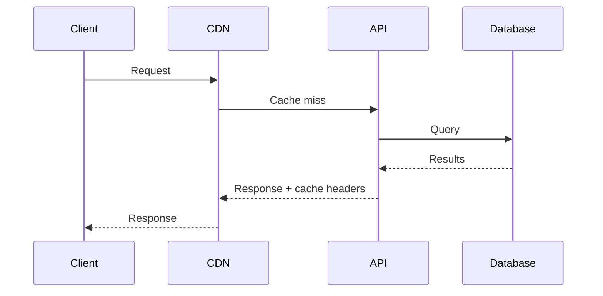

# Writing Guide

Style, structure, and content guidance for technical blog posts.

## Post Types

### 1. Tutorial / How-To

Step-by-step instruction. The reader should be able to follow along and build something.

```
Structure:
1. What we're building (with screenshot/demo)
2. Prerequisites
3. Step 1: Setup
4. Step 2: Core implementation
5. Step 3: ...
6. Complete code (GitHub link)
7. Next steps / extensions
```

| Rule | Why |
|------|-----|
| Show the end result first | Reader knows if it's worth continuing |
| List prerequisites explicitly | Don't waste time of wrong audience |
| Every code block should be runnable | Copy-paste-run is the test |
| Explain the "why" not just the "how" | Tutorials that explain reasoning get shared |
| Include error handling | Real code has errors |
| Link to complete code repo | Reference after tutorial |

### 2. Deep Dive / Explainer

Explains a concept, technology, or architecture decision in depth.

```
Structure:
1. What is [concept] and why should you care?
2. How it works (simplified mental model)
3. How it works (detailed mechanics)
4. Real-world example
5. Trade-offs and when NOT to use it
6. Further reading
```

### 3. Postmortem / Incident Report

Describes what went wrong, why, and what was fixed.

```
Structure:
1. Summary (what happened, impact, duration)
2. Timeline of events
3. Root cause analysis
4. Fix implemented
5. What we're doing to prevent recurrence
6. Lessons learned
```

### 4. Benchmark / Comparison

Data-driven comparison of tools, approaches, or architectures.

```
Structure:
1. What we compared and why
2. Methodology (so results are reproducible)
3. Results with charts/tables
4. Analysis (what the numbers mean)
5. Recommendation (with caveats)
6. Raw data / reproducibility instructions
```

### 5. Architecture / System Design

Explains how a system is built and why decisions were made.

```
Structure:
1. Problem we needed to solve
2. Constraints and requirements
3. Options considered
4. Architecture chosen (with diagram)
5. Trade-offs we accepted
6. Results and lessons
```

### 6. Announcement

News, updates, or launches.

```
Structure:
1. What's new (lead with the news)
2. Why it matters
3. How to use it
4. What's next
```

## Voice and Tone

| Do | Don't |
|----|-------|
| Be direct: "Use connection pooling" | "You might want to consider using..." |
| Admit trade-offs: "This adds complexity" | Pretend your solution is perfect |
| Use "we" for team decisions | "I single-handedly architected..." |
| Specific numbers: "reduced p99 from 800ms to 90ms" | "significantly improved performance" |
| Cite sources and benchmarks | Make unsourced claims |
| Acknowledge alternatives | Pretend yours is the only way |

## Tone Preservation

When processing existing content, respect the author's original intent:

| If Source Is | Preserve | Don't Add |
|-------------|----------|-----------|
| **Polish only** | Original structure, tone, content | TL;DR, "Why This Matters", restructuring |
| Reference/List | Bullet format, links, descriptions | TL;DR, "Why This Matters", recommendations |
| Tutorial | Step structure, runnable code | Opinion sections, benchmarks |
| Deep Dive | Conceptual explanations | "Simply do X", marketing language |
| Benchmark | Data tables, methodology | Strong recommendations without data |

**Polish Only Rules**:
- Add frontmatter if missing
- Fix broken markdown (unclosed code blocks, etc.)
- Fix typos and obvious errors
- Ensure consistent formatting
- DO NOT add: TL;DR, "Why This Matters", conclusion sections
- DO NOT restructure: keep original heading hierarchy
- DO NOT expand: keep original scope

**Rule**: Default to "Polish only" unless user explicitly requests transformation.

## What Developers Hate

```
❌ "In today's fast-paced world of technology..." (filler)
❌ "As we all know..." (if we all know, why are you writing it?)
❌ "Simply do X" (nothing is simple if you're reading a tutorial)
❌ "It's easy to..." (dismissive of reader's experience)
❌ "Obviously..." (if it's obvious, don't write it)
❌ Marketing language in technical content
❌ Burying the lede under 3 paragraphs of context
```

## Code Examples

| Rule | Why |
|------|-----|
| Every code block must be runnable | Broken examples destroy trust |
| Show complete, working examples | Snippets without context are useless |
| Include language identifier in fenced blocks | Syntax highlighting |
| Show output/result after code | Reader verifies understanding |
| Use realistic variable names | `calculateTotalRevenue` not `foo` |
| Include error handling in examples | Real code handles errors |
| Pin dependency versions | "Works with React 18.2" not "React" |

### Good Code Block Format

```python
# What this code does (one line)
def calculate_retry_delay(attempt: int, base_delay: float = 1.0) -> float:
    """Exponential backoff with jitter."""
    delay = base_delay * (2 ** attempt)
    jitter = random.uniform(0, delay * 0.1)
    return delay + jitter

# Usage
delay = calculate_retry_delay(attempt=3)  # ~8.0-8.8 seconds
```

## Explanation Depth

| Audience Signal | Depth |
|----------------|-------|
| "Getting started with X" | Explain everything, assume no prior knowledge |
| "Advanced X patterns" | Skip basics, go deep on nuances |
| "X vs Y" | Assume familiarity with both, focus on differences |
| "How we built X" | Technical audience, can skip fundamentals |

**State your assumed audience level explicitly** at the start:

```
"This post assumes familiarity with Docker and basic Kubernetes concepts.
If you're new to containers, start with [our intro post]."
```

## Ideal Structure

```markdown
# Title (contains primary keyword, states outcome)

[Hero image or diagram]

**TL;DR:** [2-3 sentence summary with key takeaway]

## The Problem / Why This Matters
[Set up why the reader should care — specific, not generic]

## The Solution / How We Did It
[Core content — code, architecture, explanation]

### Step 1: [First thing]
[Explanation + code + output]

### Step 2: [Second thing]
[Explanation + code + output]

## Results
[Numbers, benchmarks, outcomes — be specific]

## Trade-offs and Limitations
[Honest about downsides — builds trust]

## Conclusion
[Key takeaway + what to do next]

## Further Reading
[3-5 relevant links]
```

## Word Count by Type

| Type | Word Count | Why |
|------|-----------|-----|
| Quick tip | 500-800 | One concept, one example |
| Tutorial | 1,500-3,000 | Step-by-step needs detail |
| Deep dive | 2,000-4,000 | Thorough exploration |
| Architecture post | 2,000-3,500 | Diagrams carry some load |
| Benchmark | 1,500-2,500 | Data and charts do heavy lifting |
| Announcement | 500-1,000 | Get to the point |
| Opinion | 800-1,500 | Make your case, move on |

## Diagrams and Visuals

### When to Use Diagrams

| Scenario | Diagram Type |
|----------|-------------|
| Request flow | Sequence diagram |
| System architecture | Box-and-arrow diagram |
| Decision logic | Flowchart |
| Data model | ER diagram |
| Performance comparison | Bar/line chart |
| Before/after | Side-by-side |

Use Mermaid for diagrams in Jekyll:

```markdown

```

## Common Mistakes

| Mistake | Problem | Fix |
|---------|---------|-----|
| No TL;DR | Busy devs leave before getting the point | 2-3 sentence summary at the top |
| Broken code examples | Destroys all credibility | Test every code block before publishing |
| No version pinning | Code breaks in 6 months | "Works with Node 20, React 18.2" |
| "Simply do X" | Dismissive, condescending | Remove "simply", "just", "easily" |
| No diagrams for architecture | Walls of text describing systems | One diagram > 500 words of description |
| Marketing tone | Developers instantly disengage | Direct, technical, honest |
| No trade-offs section | Reads as biased marketing | Always discuss downsides |
| Giant introduction before content | Readers bounce | Get to the point in 2-3 paragraphs |
| Unpinned dependencies | Tutorial breaks for future readers | Pin versions, note date written |
| No "Further Reading" | Dead end, no context | 3-5 links to deepen understanding |
